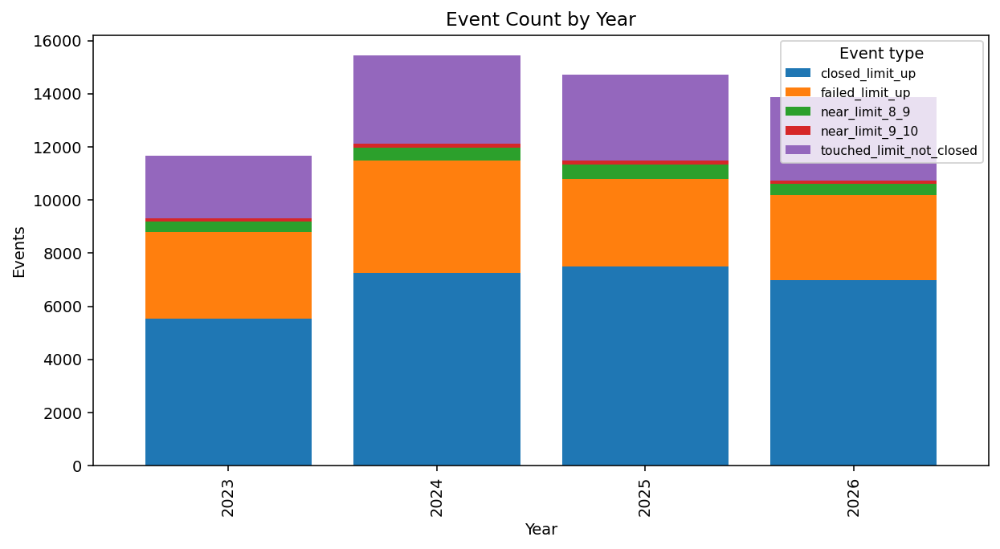
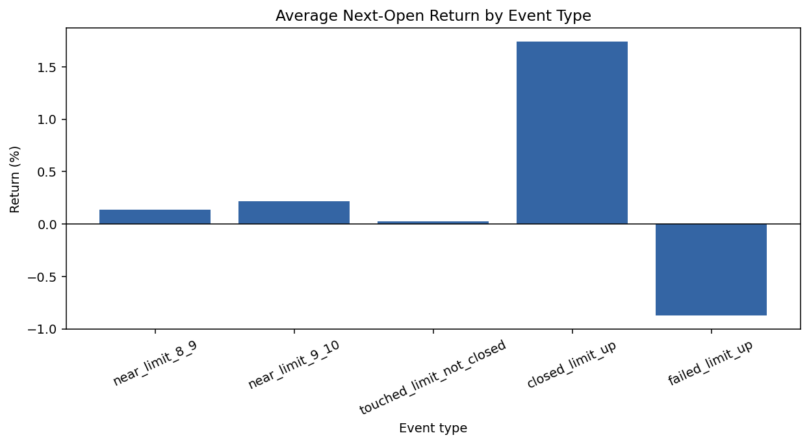
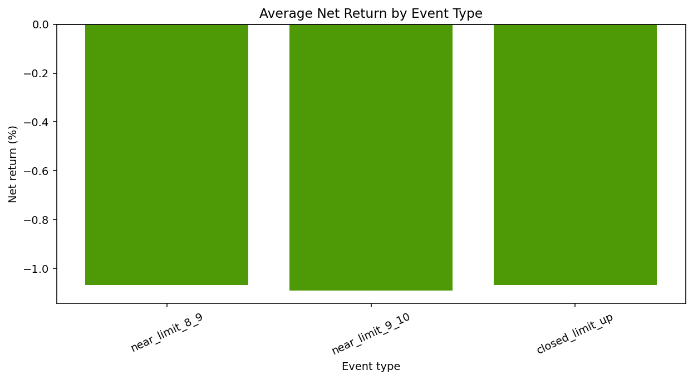
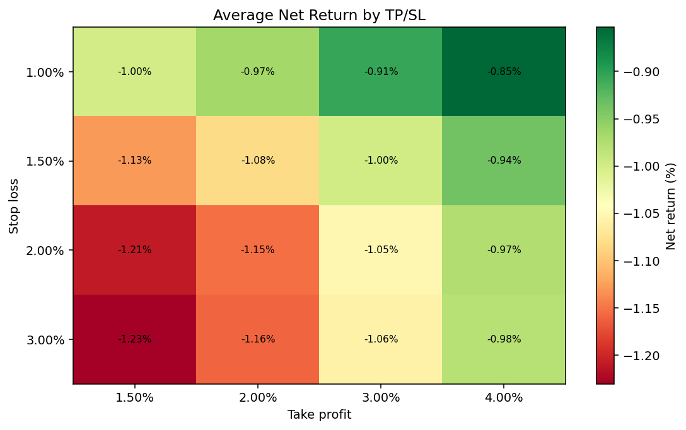
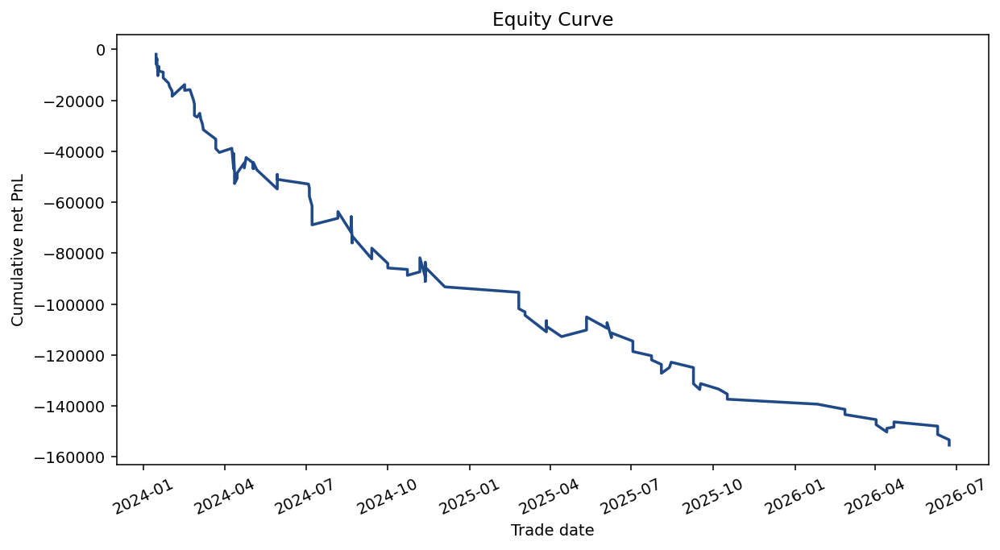
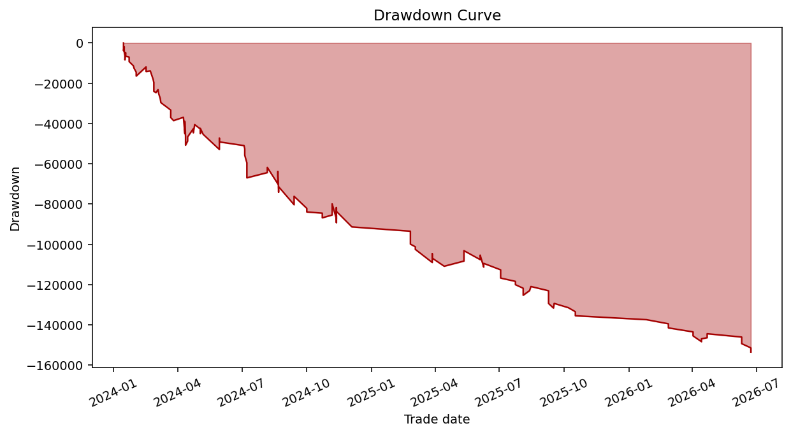

# Taiwan Limit-Momentum Research Report

Generated from `reports`.

## 1. Executive summary

- Event study rows available: 55,715.
- Daily strategy trades available: 5,866; intraday trades available: 0.
- Walk-forward selected test rows available: 50.
- `near_limit_8_9` observations: 1,833 with average approx-net next-open return -0.40%.
- Key-question read: No, the current outputs do not show positive continuation for this cohort.

## 2. Data coverage

DuckDB `daily_prices` coverage:

| market | rows      | symbols | start_date | end_date   | total_turnover_twd  |
| ------ | --------- | ------- | ---------- | ---------- | ------------------- |
| TPEX   | 677,681   | 914     | 2023-01-03 | 2026-06-24 | 89,524,372,733,405  |
| TWSE   | 1,018,385 | 1,466   | 2023-01-03 | 2026-06-24 | 366,585,401,343,658 |

Event-study CSV coverage:

| event_rows | symbols | markets    | start      | end        | day1_observations |
| ---------- | ------- | ---------- | ---------- | ---------- | ----------------- |
| 55,715     | 2,179   | TPEX, TWSE | 2023-01-04 | 2026-06-24 | 55,496            |

Generated output inventory:

| output                              | status    | rows   | columns |
| ----------------------------------- | --------- | ------ | ------- |
| event_study_daily.csv               | available | 55,715 | 63      |
| event_study_summary.csv             | available | 14,772 | 59      |
| feature_performance_by_bucket.csv   | available | 40     | 10      |
| strategy_limit_momentum_trades.csv  | available | 5,866  | 46      |
| strategy_limit_momentum_summary.csv | available | 30     | 14      |
| intraday_opening_trades.csv         | missing   | 0      | 0       |
| intraday_opening_summary.csv        | missing   | 0      | 0       |
| grid_search_results.csv             | available | 92,160 | 53      |
| grid_search_top_train.csv           | available | 100    | 53      |
| grid_search_top_test.csv            | available | 100    | 53      |
| walk_forward_results.csv            | available | 50     | 55      |
| walk_forward_selected_configs.csv   | available | 50     | 83      |
| walk_forward_oos_equity_curve.csv   | available | 140    | 10      |

## 3. Taiwan market assumptions and cost assumptions

- Taiwan equity price limits are treated as the standard +/-10% rule with the existing project tick-size approximation.
- Daily strategy entries buy at Day 1 open and exit at Day 1 close, take-profit, or stop-loss depending on the run.
- Intraday strategy entries use Day 1 opening-window confirmation and 1-minute bars when imported.
- Default commission is `0.1425%` per side with configurable broker discount; the default discount multiplier is `0.28`.
- Qualified day-trade sell tax defaults to `0.15%`; normal sell tax can be modeled separately at `0.30%`.
- Default slippage is `5` bps per side, plus configurable minimum commission.
- Position sizing is fixed notional rounded down to 1,000-share board lots unless later strategy modules override it.

## 4. Event frequency by type

| event_type               | event_count | symbols | first_date | last_date  |
| ------------------------ | ----------- | ------- | ---------- | ---------- |
| near_limit_8_9           | 1,833       | 1,041   | 2023-01-04 | 2026-06-24 |
| near_limit_9_10          | 532         | 427     | 2023-01-04 | 2026-06-24 |
| touched_limit_not_closed | 12,066      | 1,844   | 2023-01-04 | 2026-06-24 |
| closed_limit_up          | 27,267      | 2,127   | 2023-01-04 | 2026-06-24 |
| failed_limit_up          | 14,017      | 2,019   | 2023-01-04 | 2026-06-24 |

## 5. Event study

| event_type               | event_count | day1_observation_count | avg_day0_return | mean_next_open_return | p_value_next_open_return_gt_0 | mean_next_close_return | p_value_next_close_return_gt_0 | mean_open_to_close_return | mean_approx_net_next_open_return | mean_approx_net_next_close_return | win_next_open_rate | win_next_close_rate | hit_plus_2_intraday_rate |
| ------------------------ | ----------- | ---------------------- | --------------- | --------------------- | ----------------------------- | ---------------------- | ------------------------------ | ------------------------- | -------------------------------- | --------------------------------- | ------------------ | ------------------- | ------------------------ |
| near_limit_8_9           | 1,833       | 1,810                  | 0.0842          | 0.0014                | 0.0599                        | -0.0033                | 0.9967                         | -0.0045                   | -0.0040                          | -0.0086                           | 0.4719             | 0.3846              | 0.4528                   |
| near_limit_9_10          | 532         | 522                    | 0.0932          | 0.0022                | 0.1834                        | -0.0034                | 0.8802                         | -0.0051                   | -0.0032                          | -0.0087                           | 0.4549             | 0.3853              | 0.4436                   |
| touched_limit_not_closed | 12,066      | 12,029                 | 0.0570          | 0.0003                | 0.2993                        | -0.0030                | 1.0000                         | -0.0031                   | -0.0051                          | -0.0084                           | 0.4670             | 0.4041              | 0.5370                   |
| closed_limit_up          | 27,267      | 27,170                 | 0.1839          | 0.0174                | 0.0000                        | 0.0139                 | 0.0000                         | -0.0028                   | 0.0120                           | 0.0086                            | 0.6893             | 0.5810              | 0.5735                   |
| failed_limit_up          | 14,017      | 13,965                 | 0.1993          | -0.0087               | 1.0000                        | -0.0120                | 1.0000                         | -0.0031                   | -0.0141                          | -0.0173                           | 0.4749             | 0.4064              | 0.5058                   |

Institutional and margin feature bucket performance:

| feature_name                            | feature_bucket | event_type               | event_count | mean_next_open_return | mean_next_close_return | mean_approx_net_open_to_close_return |
| --------------------------------------- | -------------- | ------------------------ | ----------- | --------------------- | ---------------------- | ------------------------------------ |
| foreign_net_buy_to_turnover             | missing        | closed_limit_up          | 27,267      | 0.0174                | 0.0139                 | -0.0082                              |
| foreign_net_buy_to_turnover             | missing        | failed_limit_up          | 14,017      | -0.0087               | -0.0120                | -0.0084                              |
| foreign_net_buy_to_turnover             | missing        | near_limit_8_9           | 1,833       | 0.0014                | -0.0033                | -0.0098                              |
| foreign_net_buy_to_turnover             | missing        | near_limit_9_10          | 532         | 0.0022                | -0.0034                | -0.0105                              |
| foreign_net_buy_to_turnover             | missing        | touched_limit_not_closed | 12,066      | 0.0003                | -0.0030                | -0.0085                              |
| investment_trust_net_buy_to_turnover    | missing        | closed_limit_up          | 27,267      | 0.0174                | 0.0139                 | -0.0082                              |
| investment_trust_net_buy_to_turnover    | missing        | failed_limit_up          | 14,017      | -0.0087               | -0.0120                | -0.0084                              |
| investment_trust_net_buy_to_turnover    | missing        | near_limit_8_9           | 1,833       | 0.0014                | -0.0033                | -0.0098                              |
| investment_trust_net_buy_to_turnover    | missing        | near_limit_9_10          | 532         | 0.0022                | -0.0034                | -0.0105                              |
| investment_trust_net_buy_to_turnover    | missing        | touched_limit_not_closed | 12,066      | 0.0003                | -0.0030                | -0.0085                              |
| dealer_net_buy_to_turnover              | missing        | closed_limit_up          | 27,267      | 0.0174                | 0.0139                 | -0.0082                              |
| dealer_net_buy_to_turnover              | missing        | failed_limit_up          | 14,017      | -0.0087               | -0.0120                | -0.0084                              |
| dealer_net_buy_to_turnover              | missing        | near_limit_8_9           | 1,833       | 0.0014                | -0.0033                | -0.0098                              |
| dealer_net_buy_to_turnover              | missing        | near_limit_9_10          | 532         | 0.0022                | -0.0034                | -0.0105                              |
| dealer_net_buy_to_turnover              | missing        | touched_limit_not_closed | 12,066      | 0.0003                | -0.0030                | -0.0085                              |
| total_institutional_net_buy_to_turnover | missing        | closed_limit_up          | 27,267      | 0.0174                | 0.0139                 | -0.0082                              |
| total_institutional_net_buy_to_turnover | missing        | failed_limit_up          | 14,017      | -0.0087               | -0.0120                | -0.0084                              |
| total_institutional_net_buy_to_turnover | missing        | near_limit_8_9           | 1,833       | 0.0014                | -0.0033                | -0.0098                              |
| total_institutional_net_buy_to_turnover | missing        | near_limit_9_10          | 532         | 0.0022                | -0.0034                | -0.0105                              |
| total_institutional_net_buy_to_turnover | missing        | touched_limit_not_closed | 12,066      | 0.0003                | -0.0030                | -0.0085                              |

## 6. Do +8-9% non-limit stocks continue upward after next open?

No, the current outputs do not show positive continuation for this cohort. The `near_limit_8_9` cohort has 1,833 events, mean next-open return 0.14%, mean next-close return -0.33%, approx-net next-open return -0.40%, and approx-net next-close return -0.86%. The one-sided next-open p-value is 0.0599.

| event_type     | event_count | day1_observation_count | avg_day0_return | mean_next_open_return | p_value_next_open_return_gt_0 | mean_next_close_return | p_value_next_close_return_gt_0 | mean_open_to_close_return | mean_approx_net_next_open_return | mean_approx_net_next_close_return | win_next_open_rate | win_next_close_rate | hit_plus_2_intraday_rate |
| -------------- | ----------- | ---------------------- | --------------- | --------------------- | ----------------------------- | ---------------------- | ------------------------------ | ------------------------- | -------------------------------- | --------------------------------- | ------------------ | ------------------- | ------------------------ |
| near_limit_8_9 | 1,833       | 1,810                  | 0.0842          | 0.0014                | 0.0599                        | -0.0033                | 0.9967                         | -0.0045                   | -0.0040                          | -0.0086                           | 0.4719             | 0.3846              | 0.4528                   |

## 7. Strategy backtest results

Daily open-to-close approximation:

| path_assumption | number_of_trades | win_rate | average_gross_return | average_net_return | median_net_return | total_net_pnl | profit_factor | max_drawdown |
| --------------- | ---------------- | -------- | -------------------- | ------------------ | ----------------- | ------------- | ------------- | ------------ |
| close_only      | 5,866            | 0.3894   | -0.0082              | -0.0114            | -0.0119           | -5,281,617    | 0.5580        | -5,306,883   |

Stop/take-profit daily OHLC approximation:

| path_assumption | number_of_trades | win_rate | average_net_return | median_net_return | total_net_pnl | profit_factor | max_drawdown | average_turnover |
| --------------- | ---------------- | -------- | ------------------ | ----------------- | ------------- | ------------- | ------------ | ---------------- |
| close_only      | 5,866            | 0.3894   | -0.0114            | -0.0119           | -5,281,617    | 0.5580        | -5,306,883   | 1,053,326,830    |
| optimistic      | 5,866            | 0.5159   | 0.0027             | 0.0190            | 1,299,604     | 1.2609        | -54,040      | 1,053,326,830    |
| pessimistic     | 5,866            | 0.2468   | -0.0107            | -0.0233           | -4,976,597    | 0.3706        | -4,980,950   | 1,053,326,830    |

Intraday opening continuation:

_No data available._

## 8. Grid search results

Top train-ranked configurations:

| event_types    | market | path_assumption | min_turnover_twd | min_volume_ratio_20d | min_close_location | take_profit_pct | stop_loss_pct | require_investment_trust_buying | avoid_margin_overcrowded | train_trades | train_avg_net_return | train_max_drawdown | test_trades | test_avg_net_return | test_net_pnl | test_max_drawdown | test_capacity_proxy_twd |
| -------------- | ------ | --------------- | ---------------- | -------------------- | ------------------ | --------------- | ------------- | ------------------------------- | ------------------------ | ------------ | -------------------- | ------------------ | ----------- | ------------------- | ------------ | ----------------- | ----------------------- |
| near_limit_8_9 | TWSE   | close_only      | 200,000,000      | 5.0000               | 0.8500             | 0.0150          | 0.0100        | false                           | false                    | 28           | 0.0063               | -14,786            | 16          | -0.0113             | -12,372      | -13,920           | 91,605,621              |
| near_limit_8_9 | TWSE   | close_only      | 200,000,000      | 5.0000               | 0.8500             | 0.0150          | 0.0150        | false                           | false                    | 28           | 0.0063               | -14,786            | 16          | -0.0113             | -12,372      | -13,920           | 91,605,621              |
| near_limit_8_9 | TWSE   | close_only      | 200,000,000      | 5.0000               | 0.8500             | 0.0150          | 0.0200        | false                           | false                    | 28           | 0.0063               | -14,786            | 16          | -0.0113             | -12,372      | -13,920           | 91,605,621              |
| near_limit_8_9 | TWSE   | close_only      | 200,000,000      | 5.0000               | 0.8500             | 0.0150          | 0.0300        | false                           | false                    | 28           | 0.0063               | -14,786            | 16          | -0.0113             | -12,372      | -13,920           | 91,605,621              |
| near_limit_8_9 | TWSE   | close_only      | 200,000,000      | 5.0000               | 0.8500             | 0.0200          | 0.0100        | false                           | false                    | 28           | 0.0063               | -14,786            | 16          | -0.0113             | -12,372      | -13,920           | 91,605,621              |
| near_limit_8_9 | TWSE   | close_only      | 200,000,000      | 5.0000               | 0.8500             | 0.0200          | 0.0150        | false                           | false                    | 28           | 0.0063               | -14,786            | 16          | -0.0113             | -12,372      | -13,920           | 91,605,621              |
| near_limit_8_9 | TWSE   | close_only      | 200,000,000      | 5.0000               | 0.8500             | 0.0200          | 0.0200        | false                           | false                    | 28           | 0.0063               | -14,786            | 16          | -0.0113             | -12,372      | -13,920           | 91,605,621              |
| near_limit_8_9 | TWSE   | close_only      | 200,000,000      | 5.0000               | 0.8500             | 0.0200          | 0.0300        | false                           | false                    | 28           | 0.0063               | -14,786            | 16          | -0.0113             | -12,372      | -13,920           | 91,605,621              |
| near_limit_8_9 | TWSE   | close_only      | 200,000,000      | 5.0000               | 0.8500             | 0.0300          | 0.0100        | false                           | false                    | 28           | 0.0063               | -14,786            | 16          | -0.0113             | -12,372      | -13,920           | 91,605,621              |
| near_limit_8_9 | TWSE   | close_only      | 200,000,000      | 5.0000               | 0.8500             | 0.0300          | 0.0150        | false                           | false                    | 28           | 0.0063               | -14,786            | 16          | -0.0113             | -12,372      | -13,920           | 91,605,621              |

Top test-ranked configurations:

| event_types              | market | path_assumption | min_turnover_twd | min_volume_ratio_20d | min_close_location | take_profit_pct | stop_loss_pct | require_investment_trust_buying | avoid_margin_overcrowded | train_trades | train_avg_net_return | train_max_drawdown | test_trades | test_avg_net_return | test_net_pnl | test_max_drawdown | test_capacity_proxy_twd |
| ------------------------ | ------ | --------------- | ---------------- | -------------------- | ------------------ | --------------- | ------------- | ------------------------------- | ------------------------ | ------------ | -------------------- | ------------------ | ----------- | ------------------- | ------------ | ----------------- | ----------------------- |
| touched_limit_not_closed | TPEX   | close_only      | 500,000,000      | 5.0000               | 0.8500             | 0.0150          | 0.0100        | false                           | false                    | 17           | -0.0051              | -13,491            | 20          | 0.0095              | 14,275       | -9,174            | 67,336,333              |
| touched_limit_not_closed | TPEX   | close_only      | 500,000,000      | 5.0000               | 0.8500             | 0.0150          | 0.0150        | false                           | false                    | 17           | -0.0051              | -13,491            | 20          | 0.0095              | 14,275       | -9,174            | 67,336,333              |
| touched_limit_not_closed | TPEX   | close_only      | 500,000,000      | 5.0000               | 0.8500             | 0.0150          | 0.0200        | false                           | false                    | 17           | -0.0051              | -13,491            | 20          | 0.0095              | 14,275       | -9,174            | 67,336,333              |
| touched_limit_not_closed | TPEX   | close_only      | 500,000,000      | 5.0000               | 0.8500             | 0.0150          | 0.0300        | false                           | false                    | 17           | -0.0051              | -13,491            | 20          | 0.0095              | 14,275       | -9,174            | 67,336,333              |
| touched_limit_not_closed | TPEX   | close_only      | 500,000,000      | 5.0000               | 0.8500             | 0.0200          | 0.0100        | false                           | false                    | 17           | -0.0051              | -13,491            | 20          | 0.0095              | 14,275       | -9,174            | 67,336,333              |
| touched_limit_not_closed | TPEX   | close_only      | 500,000,000      | 5.0000               | 0.8500             | 0.0200          | 0.0150        | false                           | false                    | 17           | -0.0051              | -13,491            | 20          | 0.0095              | 14,275       | -9,174            | 67,336,333              |
| touched_limit_not_closed | TPEX   | close_only      | 500,000,000      | 5.0000               | 0.8500             | 0.0200          | 0.0200        | false                           | false                    | 17           | -0.0051              | -13,491            | 20          | 0.0095              | 14,275       | -9,174            | 67,336,333              |
| touched_limit_not_closed | TPEX   | close_only      | 500,000,000      | 5.0000               | 0.8500             | 0.0200          | 0.0300        | false                           | false                    | 17           | -0.0051              | -13,491            | 20          | 0.0095              | 14,275       | -9,174            | 67,336,333              |
| touched_limit_not_closed | TPEX   | close_only      | 500,000,000      | 5.0000               | 0.8500             | 0.0300          | 0.0100        | false                           | false                    | 17           | -0.0051              | -13,491            | 20          | 0.0095              | 14,275       | -9,174            | 67,336,333              |
| touched_limit_not_closed | TPEX   | close_only      | 500,000,000      | 5.0000               | 0.8500             | 0.0300          | 0.0150        | false                           | false                    | 17           | -0.0051              | -13,491            | 20          | 0.0095              | 14,275       | -9,174            | 67,336,333              |

## 9. Walk-forward results

| window_id | selected_rank | event_types                    | market | path_assumption | score   | train_trades | train_avg_net_return | oos_trades | oos_avg_net_return | oos_net_pnl | oos_max_drawdown | oos_capacity_proxy_twd |
| --------- | ------------- | ------------------------------ | ------ | --------------- | ------- | ------------ | -------------------- | ---------- | ------------------ | ----------- | ---------------- | ---------------------- |
| WF001     | 1             | touched_limit_not_closed       | TPEX   | pessimistic     | -9,031  | 36           | -0.0044              | 14         | -0.0128            | -16,042     | -16,878          | 22,626,045             |
| WF001     | 2             | near_limit_8_9+near_limit_9_10 | TPEX   | pessimistic     | -9,163  | 25           | -0.0106              | 6          | -0.0149            | -7,146      | -9,423           | 25,045,880             |
| WF001     | 3             | near_limit_9_10                | BOTH   | pessimistic     | -9,232  | 20           | -0.0088              | 5          | -0.0133            | -6,024      | -7,835           | 11,271,842             |
| WF001     | 4             | near_limit_9_10                | BOTH   | pessimistic     | -9,232  | 20           | -0.0088              | 5          | -0.0133            | -6,024      | -7,835           | 11,271,842             |
| WF001     | 5             | near_limit_8_9                 | TPEX   | pessimistic     | -9,537  | 20           | -0.0124              | 5          | -0.0133            | -5,221      | -7,498           | 28,390,277             |
| WF002     | 1             | near_limit_9_10                | TWSE   | pessimistic     | -11,983 | 20           | -0.0127              | 3          | -0.0233            | -5,341      | -5,341           | 7,067,872              |
| WF002     | 2             | near_limit_9_10                | TWSE   | pessimistic     | -11,983 | 20           | -0.0127              | 3          | -0.0233            | -5,341      | -5,341           | 7,067,872              |
| WF002     | 3             | near_limit_9_10                | BOTH   | pessimistic     | -13,048 | 25           | -0.0097              | 6          | -0.0066            | -3,444      | -5,341           | 11,592,730             |
| WF002     | 4             | near_limit_9_10                | BOTH   | pessimistic     | -13,048 | 25           | -0.0097              | 6          | -0.0066            | -3,444      | -5,341           | 11,592,730             |
| WF002     | 5             | near_limit_8_9                 | TPEX   | pessimistic     | -13,286 | 25           | -0.0126              | 5          | 0.0067             | 3,234       | -1,725           | 14,221,115             |
| WF003     | 1             | near_limit_9_10                | BOTH   | pessimistic     | -10,507 | 21           | -0.0090              | 1          | 0.0266             | 2,603       | 0.0000           | 15,589,778             |
| WF003     | 2             | near_limit_9_10                | BOTH   | pessimistic     | -10,507 | 21           | -0.0090              | 1          | 0.0266             | 2,603       | 0.0000           | 15,589,778             |
| WF003     | 3             | near_limit_8_9+near_limit_9_10 | TPEX   | pessimistic     | -11,310 | 39           | -0.0074              | 6          | -0.0233            | -10,819     | -10,819          | 26,178,544             |
| WF003     | 4             | near_limit_8_9                 | TPEX   | pessimistic     | -11,669 | 30           | -0.0094              | 6          | -0.0233            | -10,819     | -10,819          | 26,178,544             |
| WF003     | 5             | near_limit_8_9+near_limit_9_10 | TPEX   | pessimistic     | -12,339 | 42           | -0.0074              | 8          | -0.0170            | -11,002     | -12,919          | 26,178,544             |
| WF004     | 1             | near_limit_9_10                | BOTH   | pessimistic     | -9,205  | 22           | -0.0074              | 4          | 0.0017             | -1,051      | -2,734           | 57,884,956             |
| WF004     | 2             | near_limit_9_10                | BOTH   | pessimistic     | -9,205  | 22           | -0.0074              | 4          | 0.0017             | -1,051      | -2,734           | 57,884,956             |
| WF004     | 3             | near_limit_9_10                | BOTH   | pessimistic     | -13,410 | 33           | -0.0084              | 5          | -0.0033            | -2,847      | -4,530           | 22,408,014             |
| WF004     | 4             | near_limit_9_10                | BOTH   | pessimistic     | -13,410 | 33           | -0.0084              | 5          | -0.0033            | -2,847      | -4,530           | 22,408,014             |
| WF004     | 5             | near_limit_9_10                | BOTH   | pessimistic     | -14,697 | 30           | -0.0092              | 5          | -0.0033            | -3,213      | -4,896           | 93,361,898             |

## 10. Best-performing robust configs

| event_types                    | market | path_assumption | selection_count | mean_oos_return | total_oos_pnl | worst_oos_drawdown | source        | test_trades | test_avg_net_return | test_net_pnl | test_max_drawdown |
| ------------------------------ | ------ | --------------- | --------------- | --------------- | ------------- | ------------------ | ------------- | ----------- | ------------------- | ------------ | ----------------- |
| near_limit_8_9                 | TPEX   | pessimistic     | 3.0000          | -0.0099         | -12,807       | -10,819            | walk_forward  |             |                     |              |                   |
| near_limit_8_9+near_limit_9_10 | TPEX   | pessimistic     | 3.0000          | -0.0184         | -28,967       | -12,919            | walk_forward  |             |                     |              |                   |
| near_limit_9_10                | BOTH   | pessimistic     | 17.0000         | -0.0019         | -38,640       | -7,835             | walk_forward  |             |                     |              |                   |
| near_limit_9_10                | TPEX   | pessimistic     | 14.0000         | -0.0145         | -21,362       | -4,071             | walk_forward  |             |                     |              |                   |
| near_limit_9_10                | TWSE   | pessimistic     | 12.0000         | -0.0189         | -37,561       | -5,341             | walk_forward  |             |                     |              |                   |
| touched_limit_not_closed       | TPEX   | pessimistic     | 1.0000          | -0.0128         | -16,042       | -16,878            | walk_forward  |             |                     |              |                   |
| touched_limit_not_closed       | TPEX   | close_only      |                 |                 |               |                    | grid_top_test | 20.0000     | 0.0095              | 14,275       | -9,174            |
| touched_limit_not_closed       | TPEX   | close_only      |                 |                 |               |                    | grid_top_test | 20.0000     | 0.0095              | 14,275       | -9,174            |
| touched_limit_not_closed       | TPEX   | close_only      |                 |                 |               |                    | grid_top_test | 20.0000     | 0.0095              | 14,275       | -9,174            |
| touched_limit_not_closed       | TPEX   | close_only      |                 |                 |               |                    | grid_top_test | 20.0000     | 0.0095              | 14,275       | -9,174            |
| touched_limit_not_closed       | TPEX   | close_only      |                 |                 |               |                    | grid_top_test | 20.0000     | 0.0095              | 14,275       | -9,174            |
| touched_limit_not_closed       | TPEX   | close_only      |                 |                 |               |                    | grid_top_test | 20.0000     | 0.0095              | 14,275       | -9,174            |
| touched_limit_not_closed       | TPEX   | close_only      |                 |                 |               |                    | grid_top_test | 20.0000     | 0.0095              | 14,275       | -9,174            |
| touched_limit_not_closed       | TPEX   | close_only      |                 |                 |               |                    | grid_top_test | 20.0000     | 0.0095              | 14,275       | -9,174            |
| touched_limit_not_closed       | TPEX   | close_only      |                 |                 |               |                    | grid_top_test | 20.0000     | 0.0095              | 14,275       | -9,174            |
| touched_limit_not_closed       | TPEX   | close_only      |                 |                 |               |                    | grid_top_test | 20.0000     | 0.0095              | 14,275       | -9,174            |

## 11. Failure modes

- 219 event rows are missing Day 1 close observations.
- Weakest event types by next-close return: failed_limit_up (-1.20%), near_limit_9_10 (-0.34%), near_limit_8_9 (-0.33%)
- Most common daily-strategy exits: stop_loss: 4205, take_profit: 1303, close_exit: 358
- Grid-search configs with fewer than 20 test trades: 6,944.
- Walk-forward selected/config rows with negative OOS PnL: 39.
- Daily OHLC stop/take-profit tests do not know the true intraday path; pessimistic assumptions should carry more weight.
- Public-data coverage and corporate-action handling should be audited before interpreting small edges.
- Strategy variants with tiny sample counts are likely overfit even when net returns look attractive.

## 12. Liquidity and capacity analysis

| source             | rows   | median_turnover_twd | avg_turnover_twd | median_capacity_5pct_twd |
| ------------------ | ------ | ------------------- | ---------------- | ------------------------ |
| event_study        | 55,715 | 170,831,563         | 1,170,903,647    | 8,541,578                |
| strategy_trades    | 5,866  | 390,266,001         | 1,053,326,830    | 19,513,300               |
| grid_test_capacity | 92,160 |                     | 1,630,374,486    | 25,154,866               |

## 13. Recommended next experiments

- Re-run the event study by market, liquidity bucket, and sector to isolate where continuation survives costs.
- Replace daily OHLC stop/take-profit assumptions with imported 1-minute bars for the same windows.
- Add corporate-action and attention filters, including suspension, disposition stocks, and abnormal turnover flags.
- Test opening auction imbalance, first-3-minute VWAP slope, and first pullback behavior for limit-up continuations.
- Stress-test commission discounts, sale-tax assumptions, slippage, and participation-rate capacity limits.
- Reserve a final untouched validation window after choosing configs from walk-forward analysis.
